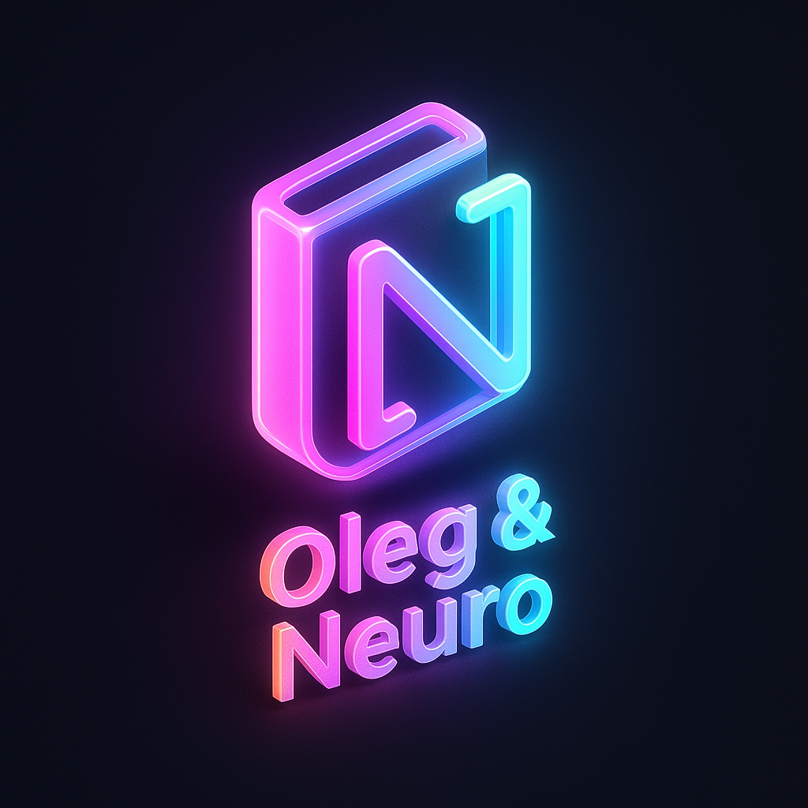
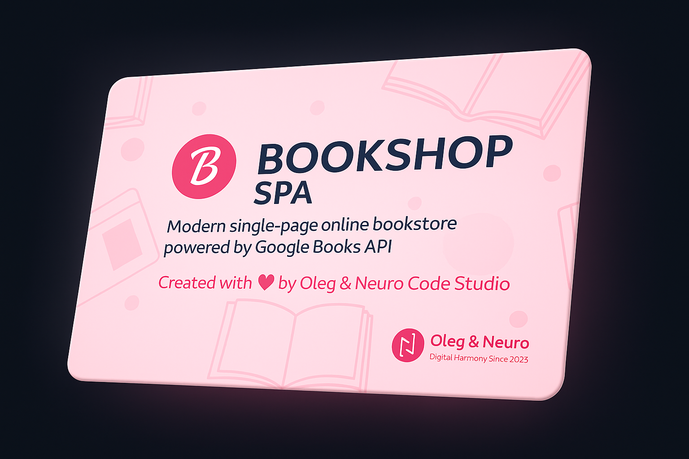

<!-- 🎨 PROJECT HEADER -->

<!-- 💎 OLEG & NEURO CODE STUDIO — OFFICIAL IDENTITY -->

<p align="center">
  
  
</p>
<p align="center">
  
</p>

<h2 align="center">💎 The Official Identity of <b>Oleg & Neuro Code Studio</b></h2>

<p align="center">
  <em>Crafted in neon & harmony — a fusion of logic, art, and emotion.</em><br>
  <sub>💫 We don’t just design — we illuminate.</sub><br>
  <sub>🧠 Built with passion by <b>Oleg & Neuro Code Studio</b></sub>
</p>

---

<!-- ✨ Neon navigation buttons -->
<p align="center">
  <a href="https://olegmbq.github.io/bookshop/brand/" target="_blank">
    
  </a>
  <a href="https://olegmbq.github.io/bookshop/" target="_blank">
    
  </a>
  <a href="https://github.com/Olegmbq" target="_blank">
    
  </a>
    <a href="https://bookshop-ruddy.vercel.app/" target="_blank">
    
  </a>
</p>

---

<p align="center">
  
</p>

<h1 align="center">📚 BOOKSHOP SPA</h1>

<p align="center">
  
</p>

<p align="center">
  <em>Created with ❤️ by <b>Oleg & Neuro Code Studio</b></em><br>
  <sub>We don’t just code — we create digital stories.</sub><br>
  <sub>Мы не просто пишем код — мы создаём вдохновение.</sub>
</p>

---

# 📚 Bookshop SPA

**by Oleg & Neuro Code Studio**

---

## 🌍 English Version

### Overview

**Bookshop SPA** — a modern single-page online bookstore powered by **Google Books API**.  
Users can explore book categories, view details, and manage their cart — all without reloading the page.

### ✨ Features

- 📘 Fetch books dynamically using **Google Books API**
- 🧠 Fully modular **ES6 architecture**
- ⚙️ Built with **Webpack 5** (minification & optimization)
- 🧩 Components written in **PUG**, **SCSS (BEM)**, and **JS Modules**
- 💾 Cart persistence via **LocalStorage**
- 🖼 Responsive layout (desktop, tablet, mobile)
- 🎢 Animated slider with auto-rotation and clickable dots
- 🔔 Smooth UI animations (hover, toast notifications, transitions)
- 🧱 Complete build system via `npm run build`

### 🧰 Technologies

- **HTML (PUG)**
- **SCSS (BEM)**
- **JavaScript (ES6 modules)**
- **Webpack 5**
- **Google Books API**
- **Axios**

---

### 🚀 Project Setup

````bash
# 🧩 Install dependencies
npm install

# ⚙️ Build main Bookshop project
npm run build

# 🚀 Run Bookshop (main site)
npm start

# 💎 Run Brand Kit (brand assets showcase)
npm run brand

# 🧹 Clean project (remove dist)
npm run clean

---

🇷🇺 Русская версия
Обзор
Bookshop SPA — это современный одностраничный интернет-магазин книг, подключённый к Google Books API.
Все действия — загрузка книг, смена категории, добавление в корзину — происходят без перезагрузки страницы.

✨ Возможности
📚 Получение данных о книгах через Google Books API

🧩 Модульная структура на ES6

⚙️ Сборка и минификация через Webpack 5

🎨 Используются PUG, SCSS (БЭМ) и JS-модули

💾 Сохранение корзины через LocalStorage

📱 Полная адаптивность под все устройства

🎢 Автоматический слайдер с плавной анимацией

🔔 Уведомления и эффекты интерфейса

🧱 Простая сборка через npm run build

🧰 Технологии
HTML (PUG)

SCSS (БЭМ)

JavaScript (ES6)

Webpack 5

Axios

Google Books API

---

🚀 Установка и запуск

```bash

# Установка всех зависимостей
npm install

# Сборка проекта Bookshop
npm run build

# Запуск Bookshop (главный сайт)
npm start

# Запуск Brand Kit (фирменная страница)
npm run brand

# Очистка проекта (удаление dist)
npm run clean

---

💎 Brand Kit Integration
A stylish presentation of our studio identity — logos, colors & QR codes.
Explore the project here → 🌌 Brand Kit by Oleg & Neuro Code Studio

Run locally:

```bash

npm run brand

---

### 👨‍💻 Authors
Oleg & Neuro Code Studio

We don’t just code — we create digital stories.
Мы не просто пишем код — мы создаём вдохновение.

---

# Запуск Brand Kit (фирменная страница)
npm run brand

---

### 💫 Authors

**Oleg & Neuro Code Studio**

We don’t just code — we create digital stories.
Мы не просто пишем код — мы создаём вдохновение.

---

````

## ❤️ Created with Love

<p align="center">
  <br><br>

<strong>Created with ❤️ by
<a href="https://github.com/Olegmbq" target="_blank">Oleg & Neuro Code Studio</a>
</strong><br>
<em>🧠 A fusion of logic, art & emotion — built with harmony and inspiration.</em><br>
<sub>© 2025 Oleg & Neuro Code Studio — All Rights Reserved.</sub>

</p>

---

<p align="center">
  🌙 Thank you for visiting our project — built with harmony & code.<br>
  ✨ Crafted with passion by <b>Oleg & Neuro Code Studio</b><br>
  🧩 Logic • 🎨 Art • ❤️ Emotion — united in one creation.<br><br>

  <pre align="center" style="color:#ff00cc; font-weight:bold;">
╔══════════════════════════════════════════════════╗
║ 💎  Oleg & Neuro Code Studio ❤️‍🔥  Bookshop Edition ║
╚══════════════════════════════════════════════════╝
  </pre>

<br>
<b>Oleg & Neuro Code Studio</b>

</p>
